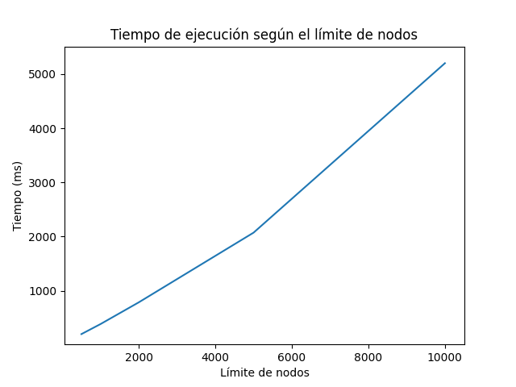
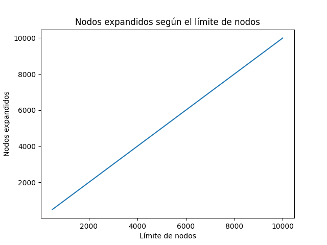
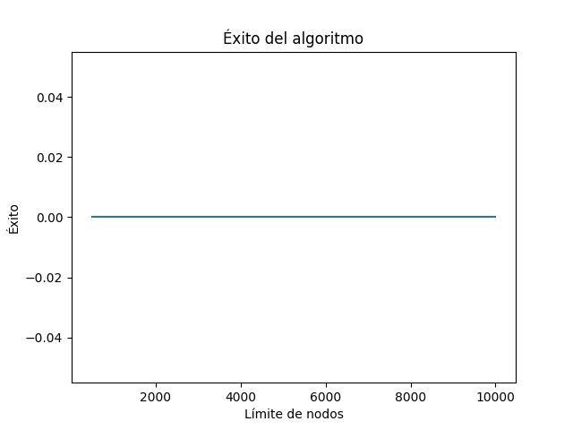

# A* para Peg Solitaire

Este proyecto consiste en la implementación del algoritmo de búsqueda **A\*** para resolver el problema de **Peg Solitaire**. La idea principal del trabajo es modelar el tablero, generar los movimientos válidos del juego y usar A\* para encontrar una secuencia de movimientos que lleve desde el estado inicial hasta el estado objetivo.

En este problema, el tablero inicia casi completamente lleno, con una única posición vacía en el centro. A partir de ahí, el algoritmo debe buscar movimientos válidos hasta llegar a una configuración final en la que quede **una sola ficha en el centro del tablero**.

---

## Descripción del problema

Peg Solitaire es un juego de tablero en el que se tienen varias fichas colocadas en una forma de cruz. Un movimiento válido consiste en que una ficha salte sobre otra ficha adyacente y caiga en un espacio vacío. La ficha que fue saltada se elimina del tablero.

En esta implementación, el tablero utilizado es el clásico de **7x7 con forma de cruz** y en tablero.py, se puede ver una representación de este, donde:
- `1` representa una ficha,
- `0` representa una casilla vacía,
- `-1` representa una posición inválida, es decir, una parte del arreglo que no pertenece realmente al tablero del juego.

El objetivo del problema no es solo dejar una ficha, sino dejar **una única ficha en la posición central**, ya que esa es la meta que se definió para este trabajo.

---

## Reglas del juego

Las reglas que se usaron en esta implementación son las siguientes:

- una ficha puede saltar sobre otra ficha que esté justo a la par;
- el salto solo puede hacerse en dirección **horizontal o vertical**;
- la casilla de destino debe estar vacía;
- la ficha que fue saltada se elimina;
- cada movimiento reduce la cantidad total de fichas en uno.

---

## Qué hace el programa

El programa toma el tablero inicial de Peg Solitaire y aplica el algoritmo A\* para explorar diferentes estados posibles del juego. En cada paso, el algoritmo genera movimientos válidos, crea nuevos tableros y calcula qué tan prometedor es cada estado usando la función:

**f(n) = g(n) + h(n)**

donde:

- **g(n)** es el costo acumulado desde el estado inicial hasta el estado actual;
- **h(n)** es una estimación de cuánto falta para llegar al objetivo;
- **f(n)** es el valor total que usa A\* para decidir cuál nodo explorar primero.

Cuando el algoritmo encuentra una solución, el programa muestra el camino encontrado, la cantidad de movimientos realizados, el número de nodos explorados y el tiempo de ejecución.

---

## Heurística utilizada

La heurística principal utilizada en este proyecto es:

**h(n) = número de fichas restantes - 1**

Esta heurística se eligió porque en Peg Solitaire cada movimiento elimina exactamente una ficha. Entonces, si todavía quedan `N` fichas en el tablero, al menos se necesitan `N - 1` movimientos para llegar a una sola ficha.

Se considera una heurística adecuada para este problema porque:
- nunca sobrestima la cantidad mínima de movimientos que faltan;
- es sencilla de calcular;
- y se ajusta directamente a la lógica del juego.

En otras palabras, esta heurística sirve como una estimación básica de cuánto falta para resolver el problema.

---

## Estructura del proyecto

El proyecto está dividido en varios archivos para que cada parte tenga una responsabilidad clara.

### `tablero.py`
En este archivo se define la clase `Tablero`, que representa el estado del juego. Aquí se crea el tablero inicial, se cuenta la cantidad de fichas, se verifica si un estado es objetivo y se manejan funciones como copiar el tablero o convertirlo a un formato que se pueda guardar en estructuras como conjuntos o diccionarios.

### `movimientos.py`
Este archivo contiene la lógica de los movimientos del juego. Aquí se generan los movimientos válidos que se pueden hacer desde un estado dado, se aplica un movimiento para obtener un nuevo tablero y también se puede verificar si un movimiento específico es válido o no.

### `heuristica.py`
En este archivo se implementa la heurística usada por el algoritmo A\*. Su función es darle una estimación al algoritmo sobre qué tan lejos está un estado actual de la meta.

### `astar.py`
Aquí se implementa el algoritmo A\* como tal. Este archivo se encarga de explorar estados, usar la cola de prioridad, calcular los costos de cada nodo y reconstruir el camino de la solución cuando se llega al objetivo.

### `main.py`
Este es el archivo principal del programa. Desde aquí se crea el tablero inicial, se ejecuta el algoritmo A\*, se mide el tiempo de ejecución y se muestran los resultados en consola.

### `pruebas.py`
Este archivo contiene pruebas sencillas para revisar que las partes principales del proyecto funcionen correctamente. Aquí se prueban cosas como la creación del tablero, la detección de movimientos válidos, la heurística y la ejecución básica del algoritmo.

---

## Cómo representar el tablero

Aunque el tablero real tiene forma de cruz, en el programa se maneja como una matriz de `7x7`. Sin embargo, no todas las posiciones de esa matriz son válidas. Por eso se usan tres valores:

- `1`: hay una ficha en esa posición;
- `0`: la posición es válida, pero está vacía;
- `-1`: esa posición no forma parte del tablero.

Esto permite trabajar de manera más sencilla con el estado del juego, recorrer el tablero con ciclos y generar movimientos legales sin tener que usar una estructura más complicada.

---

## Cómo se ejecuta

Para ejecutar el programa principal, se debe correr:

```bash
python main.py
```

Para ejecutar el archivo de las pruebas: 
```bash
python pruebas.py
```

## Resultados obtenidos

Al ejecutar el algoritmo con el tablero clásico de Peg Solitaire, se registraron datos como el tiempo de ejecución, la cantidad de nodos expandidos, la cantidad de nodos generados y el número de movimientos de la solución, en caso de encontrarse una. Estos resultados permiten observar el comportamiento del algoritmo A* y el efecto de la heurística utilizada: 

1. Ejecutando en consola, y con un maximo de nodos de 100000, no encontró una solución, y estos fueron los resultados
---
======================================================================
  PEG SOLITAIRE - SOLUCION CON A*
======================================================================


TABLERO INICIAL
Estado inicial del juego:
       O  O  O
       O  O  O
 O  O  O  O  O  O  O
 O  O  O  -  O  O  O
 O  O  O  O  O  O  O
       O  O  O
       O  O  O
Fichas: 32


REGLAS DEL JUEGO:
- Salta una ficha sobre otra (ortogonalmente)
- La ficha saltada se elimina
- OBJETIVO: Dejar solo 1 ficha en el centro del tablero
- Total de movimientos posibles: ~5 millones
- Profundidad de solucion optima: ~31 movimientos

======================================================================
  EJECUTANDO A*
======================================================================

Iniciando busqueda...
Heuristica usada:
  - Numero de fichas restantes - 1
  - Cada movimiento elimina exactamente una ficha

  [Inicio] f(0) = 0 + 31.0 = 31.0
  Fichas: 32
  Expandidos: 1, Cola abierta: 0, f(n)=31.0, fichas=32
  Expandidos: 1001, Cola abierta: 3480, f(n)=31.0, fichas=27
  Expandidos: 2001, Cola abierta: 6727, f(n)=31.0, fichas=26
  Expandidos: 3001, Cola abierta: 9931, f(n)=31.0, fichas=26
  Expandidos: 4001, Cola abierta: 12841, f(n)=31.0, fichas=26
  Expandidos: 5001, Cola abierta: 15621, f(n)=31.0, fichas=26
  Expandidos: 6001, Cola abierta: 18303, f(n)=31.0, fichas=26
  Expandidos: 7001, Cola abierta: 20998, f(n)=31.0, fichas=26
  Expandidos: 8001, Cola abierta: 24139, f(n)=31.0, fichas=25
  Expandidos: 9001, Cola abierta: 27333, f(n)=31.0, fichas=25
  Expandidos: 10001, Cola abierta: 30118, f(n)=31.0, fichas=25
  Expandidos: 11001, Cola abierta: 33082, f(n)=31.0, fichas=25
  Expandidos: 12001, Cola abierta: 35773, f(n)=31.0, fichas=25
  Expandidos: 13001, Cola abierta: 38392, f(n)=31.0, fichas=25
  Expandidos: 14001, Cola abierta: 40426, f(n)=31.0, fichas=25
  Expandidos: 15001, Cola abierta: 43277, f(n)=31.0, fichas=25
  Expandidos: 16001, Cola abierta: 46346, f(n)=31.0, fichas=25
  Expandidos: 17001, Cola abierta: 48595, f(n)=31.0, fichas=25
  Expandidos: 18001, Cola abierta: 50824, f(n)=31.0, fichas=25
  Expandidos: 19001, Cola abierta: 53238, f(n)=31.0, fichas=25
  Expandidos: 20001, Cola abierta: 55884, f(n)=31.0, fichas=25
  Expandidos: 21001, Cola abierta: 58665, f(n)=31.0, fichas=25
  Expandidos: 22001, Cola abierta: 61166, f(n)=31.0, fichas=25
  Expandidos: 23001, Cola abierta: 63263, f(n)=31.0, fichas=25
  Expandidos: 24001, Cola abierta: 65437, f(n)=31.0, fichas=25
  Expandidos: 25001, Cola abierta: 67895, f(n)=31.0, fichas=25
  Expandidos: 26001, Cola abierta: 69932, f(n)=31.0, fichas=25
  Expandidos: 27001, Cola abierta: 72501, f(n)=31.0, fichas=25
  Expandidos: 28001, Cola abierta: 75006, f(n)=31.0, fichas=25
  Expandidos: 29001, Cola abierta: 77025, f(n)=31.0, fichas=25
  Expandidos: 30001, Cola abierta: 80434, f(n)=31.0, fichas=24
  Expandidos: 31001, Cola abierta: 83652, f(n)=31.0, fichas=24
  Expandidos: 32001, Cola abierta: 86472, f(n)=31.0, fichas=24
  Expandidos: 33001, Cola abierta: 89539, f(n)=31.0, fichas=24
  Expandidos: 34001, Cola abierta: 92171, f(n)=31.0, fichas=24
  Expandidos: 35001, Cola abierta: 94474, f(n)=31.0, fichas=24
  Expandidos: 36001, Cola abierta: 97460, f(n)=31.0, fichas=24
  Expandidos: 37001, Cola abierta: 99912, f(n)=31.0, fichas=24
  Expandidos: 38001, Cola abierta: 102028, f(n)=31.0, fichas=24
  Expandidos: 39001, Cola abierta: 104523, f(n)=31.0, fichas=24
  Expandidos: 40001, Cola abierta: 107163, f(n)=31.0, fichas=24
  Expandidos: 41001, Cola abierta: 109411, f(n)=31.0, fichas=24
  Expandidos: 42001, Cola abierta: 111929, f(n)=31.0, fichas=24
  Expandidos: 43001, Cola abierta: 114782, f(n)=31.0, fichas=24
  Expandidos: 44001, Cola abierta: 117541, f(n)=31.0, fichas=24
  Expandidos: 45001, Cola abierta: 120184, f(n)=31.0, fichas=24
  Expandidos: 46001, Cola abierta: 122074, f(n)=31.0, fichas=24
  Expandidos: 47001, Cola abierta: 124564, f(n)=31.0, fichas=24
  Expandidos: 48001, Cola abierta: 126711, f(n)=31.0, fichas=24
  Expandidos: 49001, Cola abierta: 129130, f(n)=31.0, fichas=24
  Expandidos: 50001, Cola abierta: 131190, f(n)=31.0, fichas=24
  Expandidos: 51001, Cola abierta: 133118, f(n)=31.0, fichas=24
  Expandidos: 52001, Cola abierta: 135118, f(n)=31.0, fichas=24
  Expandidos: 53001, Cola abierta: 136847, f(n)=31.0, fichas=24
  Expandidos: 54001, Cola abierta: 138373, f(n)=31.0, fichas=24
  Expandidos: 55001, Cola abierta: 140434, f(n)=31.0, fichas=24
  Expandidos: 56001, Cola abierta: 143237, f(n)=31.0, fichas=24
  Expandidos: 57001, Cola abierta: 145418, f(n)=31.0, fichas=24
  Expandidos: 58001, Cola abierta: 147955, f(n)=31.0, fichas=24
  Expandidos: 59001, Cola abierta: 150780, f(n)=31.0, fichas=24
  Expandidos: 60001, Cola abierta: 153538, f(n)=31.0, fichas=24
  Expandidos: 61001, Cola abierta: 156368, f(n)=31.0, fichas=24
  Expandidos: 62001, Cola abierta: 158776, f(n)=31.0, fichas=24
  Expandidos: 63001, Cola abierta: 160627, f(n)=31.0, fichas=24
  Expandidos: 64001, Cola abierta: 162666, f(n)=31.0, fichas=24
  Expandidos: 65001, Cola abierta: 164734, f(n)=31.0, fichas=24
  Expandidos: 66001, Cola abierta: 166528, f(n)=31.0, fichas=24
  Expandidos: 67001, Cola abierta: 168482, f(n)=31.0, fichas=24
  Expandidos: 68001, Cola abierta: 170271, f(n)=31.0, fichas=24
  Expandidos: 69001, Cola abierta: 171992, f(n)=31.0, fichas=24
  Expandidos: 70001, Cola abierta: 174359, f(n)=31.0, fichas=24
  Expandidos: 71001, Cola abierta: 176177, f(n)=31.0, fichas=24
  Expandidos: 72001, Cola abierta: 178472, f(n)=31.0, fichas=24
  Expandidos: 73001, Cola abierta: 180932, f(n)=31.0, fichas=24
  Expandidos: 74001, Cola abierta: 183150, f(n)=31.0, fichas=24
  Expandidos: 75001, Cola abierta: 185157, f(n)=31.0, fichas=24
  Expandidos: 76001, Cola abierta: 187386, f(n)=31.0, fichas=24
  Expandidos: 77001, Cola abierta: 189757, f(n)=31.0, fichas=24
  Expandidos: 78001, Cola abierta: 191928, f(n)=31.0, fichas=24
  Expandidos: 79001, Cola abierta: 194545, f(n)=31.0, fichas=24
  Expandidos: 80001, Cola abierta: 196772, f(n)=31.0, fichas=24
  Expandidos: 81001, Cola abierta: 198715, f(n)=31.0, fichas=24
  Expandidos: 82001, Cola abierta: 201250, f(n)=31.0, fichas=24
  Expandidos: 83001, Cola abierta: 203251, f(n)=31.0, fichas=24
  Expandidos: 84001, Cola abierta: 205086, f(n)=31.0, fichas=24
  Expandidos: 85001, Cola abierta: 206797, f(n)=31.0, fichas=24
  Expandidos: 86001, Cola abierta: 208601, f(n)=31.0, fichas=24
  Expandidos: 87001, Cola abierta: 210276, f(n)=31.0, fichas=24
  Expandidos: 88001, Cola abierta: 212250, f(n)=31.0, fichas=24
  Expandidos: 89001, Cola abierta: 214039, f(n)=31.0, fichas=24
  Expandidos: 90001, Cola abierta: 216082, f(n)=31.0, fichas=24
  Expandidos: 91001, Cola abierta: 218082, f(n)=31.0, fichas=24
  Expandidos: 92001, Cola abierta: 220457, f(n)=31.0, fichas=24
  Expandidos: 93001, Cola abierta: 222387, f(n)=31.0, fichas=24
  Expandidos: 94001, Cola abierta: 224102, f(n)=31.0, fichas=24
  Expandidos: 95001, Cola abierta: 225746, f(n)=31.0, fichas=24
  Expandidos: 96001, Cola abierta: 227735, f(n)=31.0, fichas=24
  Expandidos: 97001, Cola abierta: 230143, f(n)=31.0, fichas=24
  Expandidos: 98001, Cola abierta: 232639, f(n)=31.0, fichas=24
  Expandidos: 99001, Cola abierta: 234339, f(n)=31.0, fichas=24

  No se encontró solución en 100000 expansiones

======================================================================
  RESULTADOS
======================================================================

No se encontro solucion en 100000 expansiones

Nota: Peg Solitaire es muy complejo
Se requiere:
- Mayor limite de nodos
- Mejor heuristica
- O un tablero mas pequeño (5x5)
---

2. Están las pruebas realizadas con experimentos.py y son las pruebas de desempeño, en las cuales se quería probar el rendimiento con diferentes cantidades de nodos, y los resultados fueron las imagenes adjuntas: 





3. Realmente el algoritmo funciona, el problema es que no encuentra una solución con los nodos que se asigan en el main, y tarda mucho en verificar si encuentra la solución, entonces lo que se optó fue por hacer unas pruebas para verificar el desempeño, las cuales son las de la sección anterior, y unas pruebas controladas para verificar la correctiud, las cuales están tambien en el archivo experimentos.py y los resultados son los siguientes: 

PRUEBAS DE CORRECTITUD
  [Inicio] f(0) = 0 + 1.0 = 1.0
  Fichas: 2
  Expandidos: 1, Cola abierta: 0, f(n)=1.0, fichas=2

  [OBJETIVO ALCANZADO]
  Nodo en posición: expansión #2
  g(n) = 1 (costo real)
  h(n) = 0.0 (heurística)
  f(n) = 1.0
============================================================
Caso 1: a 1 movimiento de la meta
============================================================
Tablero inicial:
       -  -  -
       -  -  -
 -  -  -  -  -  -  -
 -  O  O  -  -  -  -
 -  -  -  -  -  -  -
       -  -  -
       -  -  -

Sí encontró solución
Movimientos: 1
Costo total: 1
Nodos expandidos: 2
Nodos generados: 3
Tiempo: 4.30 ms

Estado final:
       -  -  -
       -  -  -
 -  -  -  -  -  -  -
 -  -  -  O  -  -  -
 -  -  -  -  -  -  -
       -  -  -
       -  -  -
¿Es objetivo?: True

  [Inicio] f(0) = 0 + 2.0 = 2.0
  Fichas: 3
  Expandidos: 1, Cola abierta: 0, f(n)=2.0, fichas=3

  [OBJETIVO ALCANZADO]
  Nodo en posición: expansión #4
  g(n) = 2 (costo real)
  h(n) = 0.0 (heurística)
  f(n) = 2.0
  
============================================================
Caso 2: a 2 movimientos de la meta
============================================================
Tablero inicial:
       -  -  -
       O  -  -
 -  -  O  -  -  -  -
 -  O  -  -  -  -  -
 -  -  -  -  -  -  -
       -  -  -
       -  -  -

Sí encontró solución
Movimientos: 2
Costo total: 2
Nodos expandidos: 4
Nodos generados: 5
Tiempo: 2.00 ms

Estado final:
       -  -  -
       -  -  -
 -  -  -  -  -  -  -
 -  -  -  O  -  -  -
 -  -  -  -  -  -  -
       -  -  -
       -  -  -
¿Es objetivo?: True

  [Inicio] f(0) = 0 + 3.0 = 3.0
  Fichas: 4
  Expandidos: 1, Cola abierta: 0, f(n)=3.0, fichas=4

  [OBJETIVO ALCANZADO]
  Nodo en posición: expansión #5
  g(n) = 3 (costo real)
  h(n) = 0.0 (heurística)
  f(n) = 3.0

============================================================
Caso 3: a 3 movimientos de la meta
============================================================
Tablero inicial:
       -  -  -
       -  O  O
 -  -  O  -  -  -  -
 -  O  -  -  -  -  -
 -  -  -  -  -  -  -
       -  -  -
       -  -  -

Sí encontró solución
Movimientos: 3
Costo total: 3
Nodos expandidos: 5
Nodos generados: 6
Tiempo: 1.00 ms

Estado final:
       -  -  -
       -  -  -
 -  -  -  -  -  -  -
 -  -  -  O  -  -  -
 -  -  -  -  -  -  -
       -  -  -
       -  -  -
¿Es objetivo?: True 

## Decisiones de diseño

- Representación del tablero

Se decidió representar el tablero como una matriz de 7x7, aunque no todas las posiciones son válidas. Para distinguirlas, se utilizaron los valores 1 para ficha, 0 para espacio vacío y -1 para posición inválida. Esta decisión facilitó el recorrido del tablero y la generación de movimientos.

- Separación por archivos

Se dividió el proyecto en varios módulos (tablero.py, movimientos.py, heuristica.py, astar.py, main.py y pruebas.py) para mantener una estructura más ordenada y permitir que cada archivo tuviera una responsabilidad específica.

- Elección de heurística

Se eligió la heurística basada en la cantidad de fichas restantes menos uno, porque cada movimiento del juego elimina exactamente una ficha. Esto permite una estimación sencilla del progreso hacia el objetivo y facilita su justificación como heurística admisible.

- Manejo de estados repetidos

Se decidió convertir el tablero a una tupla para poder guardar estados visitados en conjuntos y diccionarios. Esto ayuda a evitar explorar varias veces el mismo estado.

